# Azure DevOps Pipeline with ONNX Runtime

<p align="center">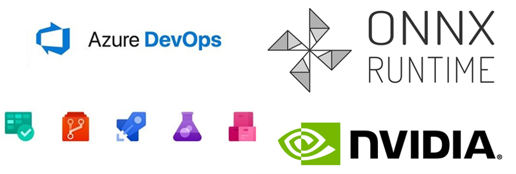</p>

This sample will setup a pipeline to train, package and deploy Machine Learning models in IoT Edge Devices. There are two phases in this pipeline.

1. __Training on AzureML__ - Train the Tiny Yolo v3 model in Azure Machine Learning and converting it to ONNX.
2. __Continuous Deployment__ - Build Docker container images and deploy to NVIDIA jetson devices on Azure IoT Edge. 

Specifically, you will learn how to:
* Train a Tiny Yolo v3 model using AzureML
* Set up a NVIDIA Jetson Nano as a Linux self-hosted DevOps agent, for building our Edge solution.
* Trigger a release pipeline, when a newly trained model is registered in the AzureML model registry, for continuous deployment.

### Acknowledgements

The Keras implementation of YOLOv3 (Tensorflow backend) inspired by [allanzelener/YAD2K](https://github.com/allanzelener/YAD2K). This sample reuses the recipes from the [qqwweee/keras-yolo3] (https://github.com/qqwweee/keras-yolo3) repo to train a keras-yolo3 model on the VOC Pascal dataset, using [AzureML](https://azure.microsoft.com/en-us/services/machine-learning/). If you are familiar with the original repository, you may want to jump right to section `Train On AzureML` below.

### A few things before you get started:

* __Setup you Azure account__: An Azure Account Subscription (with pre-paid credits or billing through existing payment channels) is required for this sample. Create the account in Azure portal using [this tutorial](https://azure.microsoft.com/en-us/free/). Your subscription must have pre-paid credits or bill through existing payment channels. (If you make an account for the first time, you can get 12 months free and $200 in credits to start with.)

* __Devices__ needed for this sample need atleast _two_ NVIDIA Jetson devices. Read more about the NVIDIA Jetson Developer Kit [here](https://www.nvidia.com/en-us/autonomous-machines/jetson-store/).

    We will use one of the Jetson devices as the Azure DevOps self-host agent to run the jobs in the DevOps pipeline. This is the _Dev machine_.
    The other Jetson device(s) will be used to deploy the IoT application containers. We will refer to these devices as _Test Device(s)_.

    > Note: If you are ordering these devices, we recommend you get power adapters (rather than relying on USB as a power source) and a wireless antenna (unless you are fine with using ethernet).

    > Note: If you don't have a NVIDIA Jetson device, this sample will provide a demonstration for how to train a yolo v3 model using AzureML.  For deployment, you could switch deployment platform from arm to amd64, to e.g. deploy to your workstation for testing.

* Before you try to create a DevOps release pipeline, we recommend that you familiarize yourself with [this](https://github.com/wmpauli/onnxruntime-iot-edge/blob/master/README-ONNXRUNTIME-arm64.md) easy to use getting started sample to deploy a ML model manually to an IoT Edge device like the Jetson device.

## <a name="S1"></a>1. Train On AzureML

In this step we will use weights for Tiny Yolo v3 from the original release by Darknet. This allows us to perform fine-tuning of a model that has already been trained on another dataset, rather than training the model from scratch. We will first convert the weights to Keras to training with TensorFlow backend. After converting the weights to Keras format (h5 extension), we can then fine-tune the model on the VOC. After training, trained model is converted to ONNX to enable us to deploy in different execution environments.

[Create your Azure Machine Learning Workspace](https://docs.microsoft.com/en-us/azure/machine-learning/how-to-manage-workspace). (_You can skip this step if you already have a workspace setup._)

[Setup the Jupyter Notebook Environment in Azure Machine Learning Workspace](https://docs.microsoft.com/en-us/azure/machine-learning/how-to-run-jupyter-notebooks) to run your Jupyter Notebooks directly in your workspace in AML studio.

[Clone this repo to your AML Workspace](https://docs.microsoft.com/en-us/azure/machine-learning/how-to-run-jupyter-notebooks#terminal) to run this training notebook.
You can use regular `git clone --recursive https://github.com/Azure-Samples/AzureDevOps-onnxrutime-jetson` CLI commands from the Notebook Terminal in AML to clone this repository into a desired folder in your workspace.

__Get Started to Train__: Open the notebook `Training-keras-yolo3-AML.ipynb` and start executing the cells to train the Tiny Yolo model. If the compute you create shows connecting for 10+ minutes, try creating a new workspace in a different region. 

## <a name="S2"></a>2. Release Pipeline

### Setup your Azure DevOps project for continuous deployment

In this step we will create the pipeline of steps to build the docker images for the Jetson devices. We will use [Azure DevOps](https://azure.microsoft.com/en-us/solutions/devops/) to create this pipeline.

#### Create a DevOps project

Go to [https://dev.azure.com/](https://dev.azure.com/) and create a new organization and project.

#### Setup Dev machine

The _Dev machine_ (i.e. Jetson device) is setup to run the jobs for the CI/CD pipeline. Since the test device is a ubuntu/ARM64 platform we will need to build the ARM64 docker images on the host platform with same HW configuration. Another approach is to setup a docker cross-build environment in Azure which is beyond the scope of this tutorial and not fully validated for ARM64 configuration.

##### Azure DevOps Agent

Install the self-hosted Azure DevOps agent onto the dev machine. Follow the instructions on this page: https://docs.microsoft.com/en-us/azure/devops/pipelines/agents/v2-linux?view=azure-devops.

##### Install Azure IoT Edge Dev Tool

The IoT Edge Dev Tool greatly simplifies Azure IoT Edge development down to simple commands driven by environment variables. We recommend that you install the tool manually on the ARM64: https://github.com/Azure/iotedgedev/wiki/manual-dev-machine-setup

##### Install core AzureML SDK for Python

We will use the AzureML SDK for Python to download the model to the DevOps agent.

You are welcome to just install the SDK system wide. Alternatively, you might want to install it inside a Conda environment - for easier housekeeping.

Because there is no official release of Anaconda/Miniconda for ARM64 devices, we recommend that you use [Archiconda](https://github.com/Archiconda/build-tools/releases).

Then, you can install the SDK like so:

```
conda create -n onnx python=3.7
conda activate onnx
pip install -U pip
pip install azureml-core
```

#### Create Service Principal

Service Principal enables non-interactive authentication for any specific user login. This is useful for setting up a machine learning workflow as an automated process.

> Note that you must have administrator privileges over the Azure subscription to complete these steps.

Follow the instructions from the section __Service Principal Authentication__ in [this notebook](https://github.com/Azure/MachineLearningNotebooks/blob/master/how-to-use-azureml/manage-azureml-service/authentication-in-azureml/authentication-in-azureml.ipynb) to create a service principal for your project. We recommend to scope the Service Principal to the _Resource Group_. When editing Access Control, select _Contributor_ and add your Service Principal to your Resource Group.

<p align="left">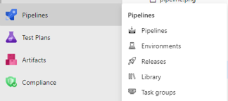</p>

#### Config for AzureML workspace

Note the configuration details of your AML Workspace in a `config.json` file. This file will later be needed for your Release Pipeline to have access to your AzureML workspace.  You can find most of the info in the Azure Portal.


```
    {
        "subscription_id": "subscription_id",
        "resource_group": "resource_group",
        "workspace_name": "workspace_name",
        "workspace_region": "workspace_region",
        "service_principal_id": "service_principal_id",
        "service_principal_password": "service_principal_password",
        "tenant_id": "tenant_id"
    }
```

> **Important:** Add `service_principal_id`, `service_principal_password`, and `tenant_id` to the `config.json` file above. You can then upload the `config.json` file to the secure file libary of your DevOps project. Make sure to enable all pipelines to have access to the secure file.

Add `config.json` to Library of secure files in the Azure DevOps project. Select on the Pipelines icon on the left, then Library. In your library go to *Secure files* and *+ Secure File*. Upload the `config.json` file and make sure to allow all pipelines to use it.

#### Add Service Connections to your DevOps project

Next, we configure the project such that the release pipeline has access to the code in github repo, to your AzureML Workspace, and to the Azure Container Registry (for Docker images).

Go to the settings of your project, `Service Connections` and click on `New Service Connection`.

- Create one Service Connection of type `GitHub`.
- Create one of type `Azure Resource Manager`. Select scope level as Machine Learning Workspace and use the same credentials from above.

<p align="left">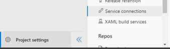</p>

#### Install MLOps extension for Azure DevOps

You can install the MLOps extension from here: [https://marketplace.visualstudio.com/items?itemName=ms-air-aiagility.vss-services-azureml](https://marketplace.visualstudio.com/items?itemName=ms-air-aiagility.vss-services-azureml). This will allow you to connect your TinyYOLO model to your pipeline.

### Create Release Pipeline

Now we can build the Release pipeline for the project by selecting __Releases__ under _Pipelines_ then __New Pipeline__ in the Azure DevOps project. Select the template for the stage as _Empty job_. 

__Connect Artifacts__

First, add the artifacts. Our pipeline is connected to two `Artifacts`.

* [This](https://github.com/Azure-Samples/onnxruntime-iot-edge) GitHub repository and, 
* Your Model Registry from the AzureML Workspace. Click on the drop down and select service principal you created. 

You can add these by clicking the `+ Add` button, next to `Artifacts`. 

__Creating Stage 1__

When the pipeline is triggered, it will execute the tasks in `Stage 1`. Start by creating an _Empty Job_. Then select __Stage 1__. First select _Agent Job_ and in _Agent Selection_ locate your Jetson Device; you may have to click on __Manage__ to find it. Now, let's add the 6 tasks for stage 1:
<p align="left">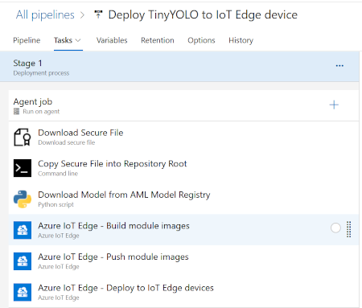</p>

__Download Secure file__

The `config.json` is downloaded from the Secure Library of our DevOps project is downloaded for the pipeline to authenticate with the different Azure services. We called our file `wopauli_onnx_config.json` in this example. Feel free to give it a different name. It helps to add some kind of identifier, in case you have other release pipelines that work with other AzureML Workspaces or Service Principals. Make sure you're passing in your path for each step below.
<p align="left">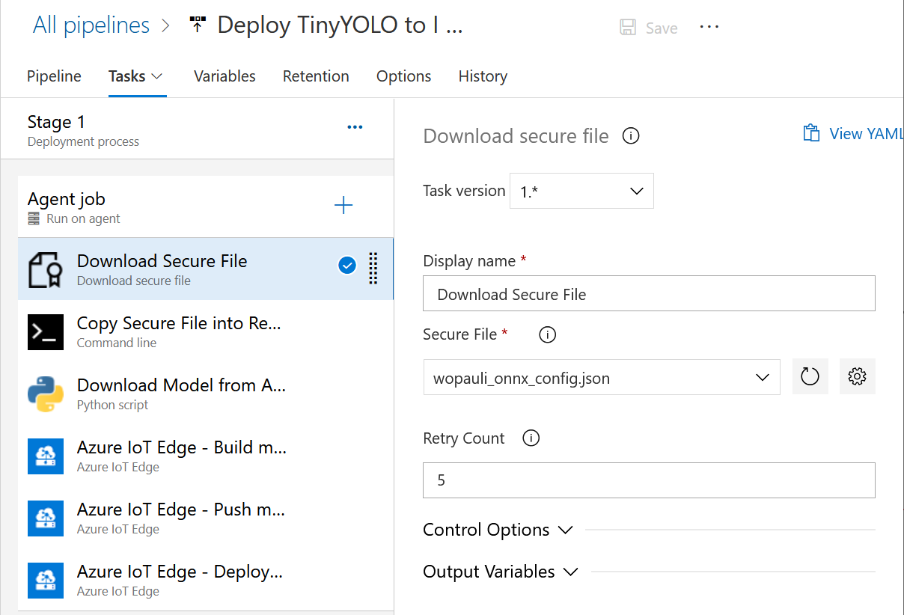</p>

__Copy Secure file__

Copy the `config.json` file from the `Agent.TempDirectory` into the `aml` folder of the cloned code repository (`cp $(Agent.TempDirectory)/config.json ./_Azure-Samples_onnxruntime-iot-edge/aml/config.json`).
<p align="left">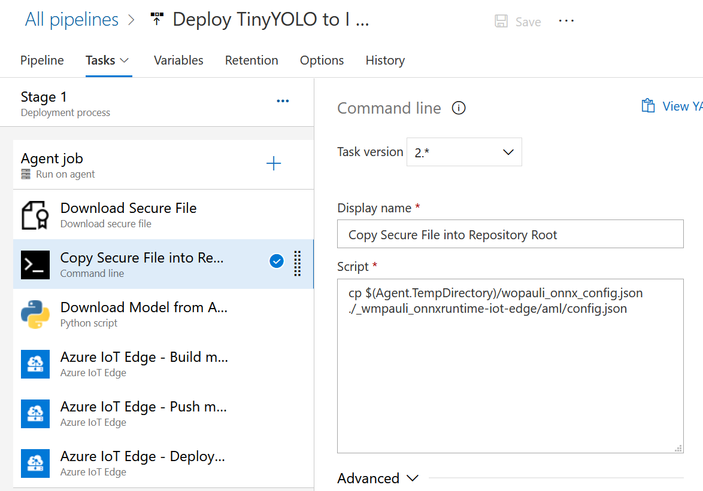</p>

> `Agent.TempDirectory` is a predefined variable. Check out what other predefined variables exist: [https://docs.microsoft.com/en-us/azure/devops/pipelines/build/variables](https://docs.microsoft.com/en-us/azure/devops/pipelines/build/variables)

__Download Model from AzureML Model Registry__

This pipeline is triggered when a new model is available in the AML Model registry. We use the AzureML SDK for Python to download the latest model from the Model Registry. This is the ONNX model we saved as the last step in the [Training step](#S1) above. (`$(System.DefaultWorkingDirectory)/_Azure-Samples_onnxruntime-iot-edge/aml/download_model.py`) Under _Advanced_, make sure to add the path to your python executable on your Jetson Device. In the conda environment you created earlier, you can find your path with `which python`. Also select the "_Azure-Samples_onnxruntime-iot-edge" working directory and check _Fail on standard error_.
<p align="left">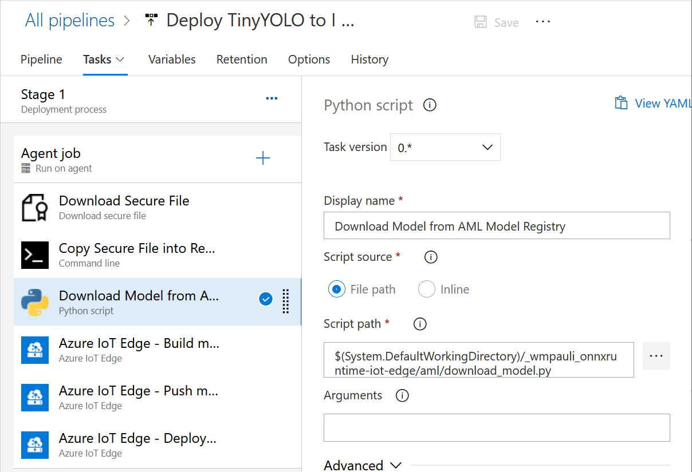</p>

__Build Modules__

Next, we will rebuild the IoT modules (docker images) of our solution to update with the new ONNX model.  Make sure you point it to the correct `deployment.template.json` file, and pick the correct `Default platform`, and `Action`.
<p align="left">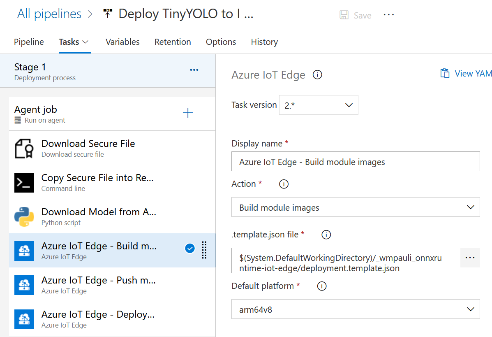</p>

__Push Modules to ACR__

After the modules are created we will push them to the Azure Container Registry. You can use the Azure Container Registry that was created in your Azure ML Workspace above. As `Azure Subscription`, pick the Service connection you created above to connect to your workspace.
<p align="left">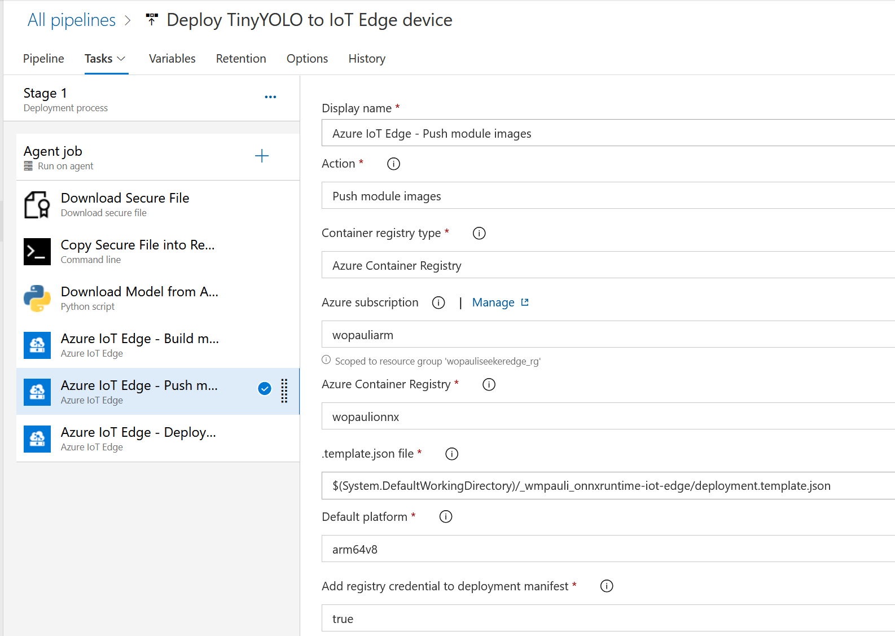</p>

__Deploy to Edge Device__

The last step of stage 1 is to deploy the modules to the Edge device. 
<p align="left">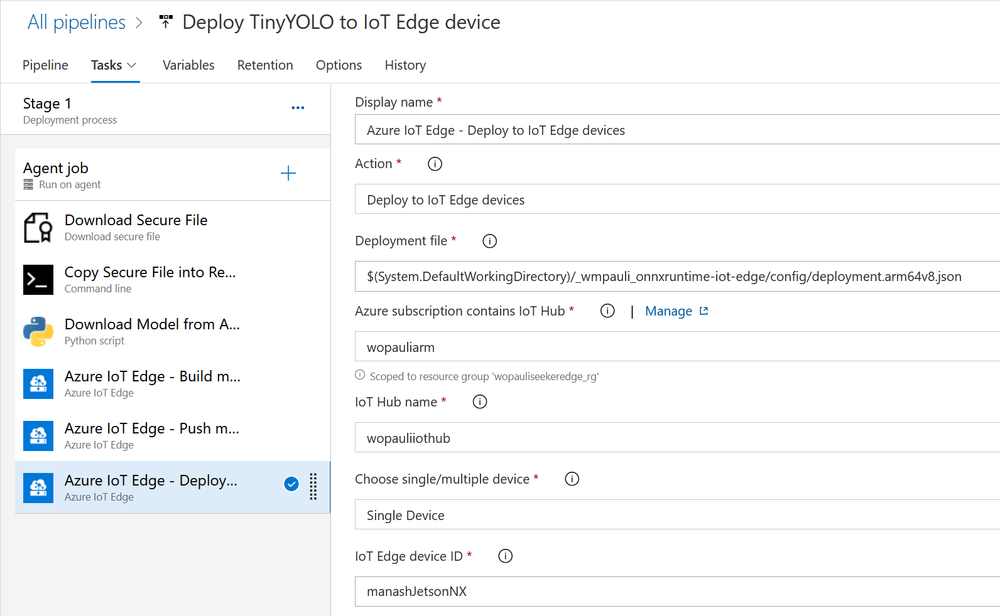</p>

__Finish Up__

The final pipeline should look like this. If you need to edit any step, select _Edit Pipeline_ and make sure to save.:
<p align="left">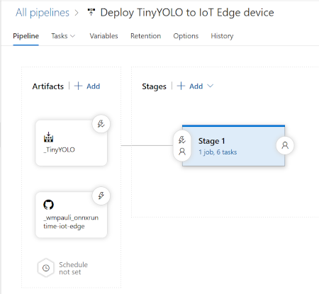</p>

#### Automate re-training-to-deployment

Now you can run `src/model_registration.py` to manually trigger a loop of this release pipeline.

Make sure to click on the Lightning Icon (continuous deployment trigger) on the `Artifact` for `_TinyYOLO` (i.e. the Model Registry in AzureML), to make sure that the release pipeline is triggered when you register a new model in the Model Registry. You can do that from __Pipeline__ -> __Release__ -> __Edit__.
<p align="left">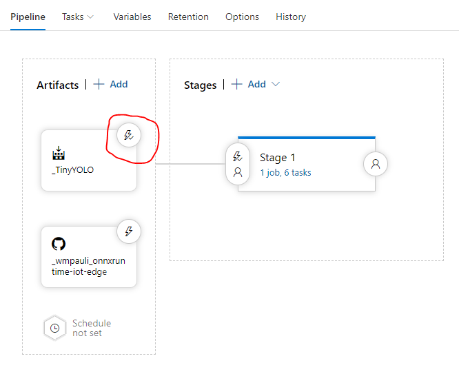</p>

### Ideas for expanding to other scenarios

You can expand this sample to address more complex Machine Learning scenarios.

* Use [AzureML MLOps](https://docs.microsoft.com/en-us/azure/machine-learning/concept-model-management-and-deployment#what-is-mlops) to increase efficiencies for the ML workflows.

* Deploy to different HW configurations by using different Docker base images in the Build step. You can update the dockerfiles to change the base image configuration but reusing the same application code and model.

==============================
## Contribution

This project welcomes contributions and suggestions. Most contributions require you to
agree to a Contributor License Agreement (CLA) declaring that you have the right to,
and actually do, grant us the rights to use your contribution. For details, visit
https://cla.microsoft.com.
 
When you submit a pull request, a CLA-bot will automatically determine whether you need
to provide a CLA and decorate the PR appropriately (e.g., label, comment). Simply follow the
instructions provided by the bot. You will only need to do this once across all repositories using our CLA.

# Legal
 
## Code of conduct
 
This project has adopted the [Microsoft Open Source Code of Conduct](https://opensource.microsoft.com/codeofconduct/).
For more information see the [Code of Conduct FAQ](https://opensource.microsoft.com/codeofconduct/faq/)
or contact [opencode@microsoft.com](mailto:opencode@microsoft.com) with any additional questions or comments.
 
## Reporting security issues
Security issues and bugs should be reported privately, via email, to the
Microsoft Security Response Center (MSRC) at [secure@microsoft.com](mailto:secure@microsoft.com).
You should receive a response within 24 hours. If for some reason you do not, please follow up via
email to ensure we received your original message. Further information, including the
[MSRC PGP](https://technet.microsoft.com/en-us/security/dn606155) key, can be found in the
[Security TechCenter](https://technet.microsoft.com/en-us/security/default).
 
## License
Copyright (c) Microsoft Corporation. All rights reserved.
 
MIT License
 
Permission is hereby granted, free of charge, to any person obtaining a copy
of this software and associated documentation files (the "Software"), to deal
in the Software without restriction, including without limitation the rights
to use, copy, modify, merge, publish, distribute, sublicense, and/or sell
copies of the Software, and to permit persons to whom the Software is
furnished to do so, subject to the following conditions:
 
The above copyright notice and this permission notice shall be included in all
copies or substantial portions of the Software.
 
THE SOFTWARE IS PROVIDED *AS IS*, WITHOUT WARRANTY OF ANY KIND, EXPRESS OR
IMPLIED, INCLUDING BUT NOT LIMITED TO THE WARRANTIES OF MERCHANTABILITY,
FITNESS FOR A PARTICULAR PURPOSE AND NONINFRINGEMENT. IN NO EVENT SHALL THE
AUTHORS OR COPYRIGHT HOLDERS BE LIABLE FOR ANY CLAIM, DAMAGES OR OTHER
LIABILITY, WHETHER IN AN ACTION OF CONTRACT, TORT OR OTHERWISE, ARISING FROM,
OUT OF OR IN CONNECTION WITH THE SOFTWARE OR THE USE OR OTHER DEALINGS IN THE
SOFTWARE.
